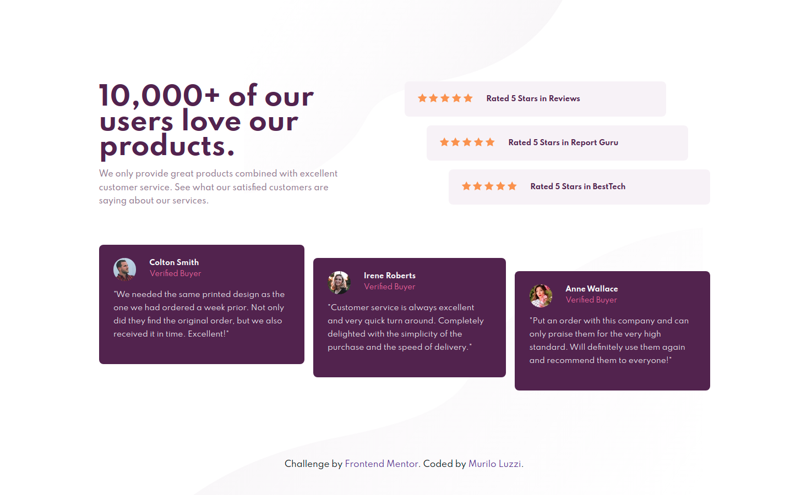

# Frontend Mentor - Social proof section solution

This is a solution to the [Social proof section challenge on Frontend Mentor](https://www.frontendmentor.io/challenges/social-proof-section-6e0qTv_bA). Frontend Mentor challenges help you improve your coding skills by building realistic projects. 

## Table of contents

- [Overview](#overview)
  - [The challenge](#the-challenge)
  - [Screenshot](#screenshot)
  - [Links](#links)
- [My process](#my-process)
  - [Built with](#built-with)
  - [What I learned](#what-i-learned)
  - [Continued development](#continued-development)
  - [Useful resources](#useful-resources)
- [Author](#author)

## Overview

### The challenge

Users should be able to:

- View the optimal layout for the section depending on their device's screen size

### Screenshot

### Links

- Solution URL: https://mlzzi.github.io/social-proof-section-master/

## My process

### Built with

- Semantic HTML5 markup
- CSS custom properties
- Flexbox
- CSS Grid
- Mobile-first workflow
- BEM methodology

### What I learned

I've applied the knoledges that I've been learning from previously challenges. In this project, the concepts of Flexbox, Grid, Mobile First and BEM were applied much faster than before. My evolution is going well and I'm very proud of it.

### Continued development

Next step is to continue with the challenges, learn and apply Javascript and in the future is to learn libraries and frameworks.

## Author

- Linkedin - https://www.linkedin.com/in/muriloluzzi/
